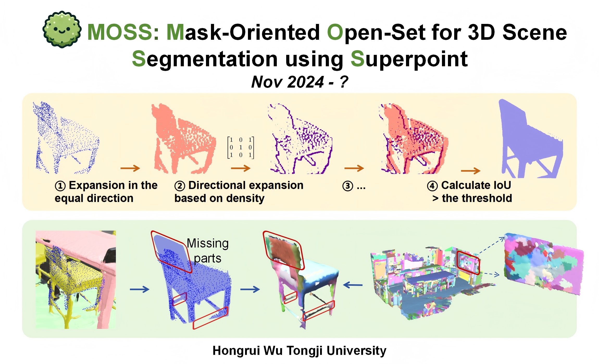
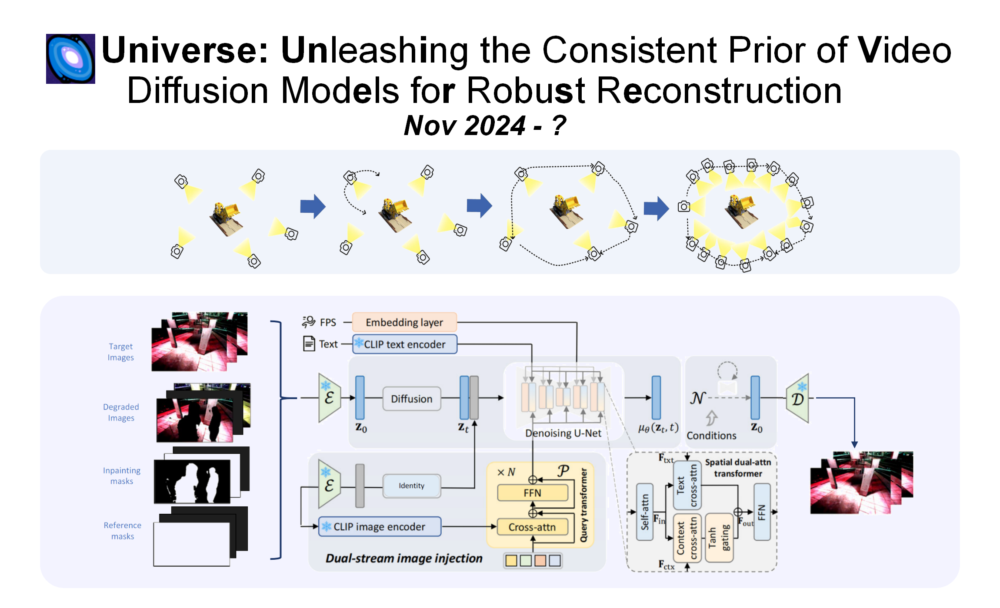

Hi there!👋

I am currently a [Computer Science](https://see-en.tongji.edu.cn/info/1010/1271.htm) junior student in [Tongji University](https://en.tongji.edu.cn/p/). During my first three years of university, I majored in [Intelligent Construction](https://civileng.tongji.edu.cn/civilengen/18034/list.htm), in the [College of Civil Engineering](https://civileng.tongji.edu.cn/civilengen/main.htm). Driven by research interests, I have transferred to CS major in April 2024 and will receive my Bachelor's degree in 2026 and actively seek 26fall PhD opportunities!🎓

<a href="/files/cv.pdf" class="cv-button" target="_blank"> 
  Here is my CV 📄
</a>

Research Interests
======
My research interests currently lie in **open-set understanding for 3D scenes** and **AIGC for 3D vision**. In the future, I aim to explore the application of generative models in **3D reconstruction** and **3D scene re-editing**.   

Through developing scalable and efficient methods, I strive to bridge the gap between real-world data and AIGC, pushing the boundaries of 3D content generation and 3D scene understanding for both academic and industrial applications.

---

Current Research
======

   

       

           <!--  -->
          
       

   

   

       <h3 style="margin-top: 0;">MOSS: Mask-Oriented Open-Set for 3D Scene Segmentation using Superpoint</h3>
       
<em>Preparing for ICCV 2025</em>

       

           <a href="../files/MOSS_pre.pdf">[PPT]</a>
           <a href="https://www.youtube.com/watch?v=iVQH0lNJSas">[Video]</a>
       

       

           The voiceover in the videos was created using ByteDance's Model <a href="https://www.doubao.com/">Doubao</a> that cloned my voice!
       

   

   

       

           
       

   

   

       <h3 style="margin-top: 0;"><strong>Universe</strong>: Unleashing the Consistent Prior of Video Diffusion Models for Robust Reconstruction</h3>
       
<em>Preparing for ICCV 2025</em>

       

           <a href="../files/Universe_pre.pdf">[PPT]</a> The full details will be presented in an interview/online chat with you!
       

   

Projects & Intern Experience
======

  

    

      <h3><a href="https://onehfr.github.io/portfolio/project-2/"> Multi-Source Time Series Prediction for Urban Infrastructure Health</a></h3>
      

        Intern team leader
        supervised by <a href="https://scholar.google.com/citations?user=HRdSfmkAAAAJ&hl=en">Prof. Jiazeng Shan</a> in <a href="https://www.glodon.com/en/">Glodon</a>
        Mar 2023 - Apr 2024
      

    

    

      
    

  

  

    

      <h3><a href="https://onehfr.github.io/portfolio/">2023-2024 Object Oriented Programming Homework @Tongji</a></h3>
      

        Code course
        
          [<a href="https://github.com/oneHFR/24-25-OOP">Code</a>]
          [<a href="../files/Report-magic-ball.pdf">Report</a>]
        
        💥 PopStar 💣 Minesweeper
      

    

    

      <video 
        autoplay 
        loop 
        muted 
        controls
        playsinline
        style="width: 100%; border-radius: 8px;">
        <source src="/images/p3-video.mp4" type="video/mp4">
      </video>
    

  

  

    

      <h3><a href="https://onehfr.github.io/portfolio/project-1/">American Society of Civil Engineers Concrete Canoe Competition</a></h3>
      

        Hull designer
        
          [<a href="https://onehfr.github.io/portfolio/">Works</a>]
          [<a href="https://docs.google.com/presentation/d/12NBXRfv-bkYV1_H_B_a9v2MSho-ZQoks/edit?usp=drive_link&ouid=104071984654367651910&rtpof=true&sd=true">PPT</a>]
          [<a href="../files/p4-paper.pdf">Paper</a>]
        
        hosted by <a href="https://www.linkedin.com/company/americansocietyofcivilengineers" target="_blank">ASCE</a> in Sacramento, CA
        May 2022 - Apr 2024
      

    

    

      <video 
        autoplay 
        loop 
        muted 
        controls
        playsinline
        style="width: 100%; border-radius: 8px;">
        <source src="/images/p4-video2.mp4" type="video/mp4">
      </video>
    

  

  

    

      <h4 class="c-viewer__title">🖱️ An interactive 3D visualization window</h4>
      <iframe 
        title="Canoe2024-Tongji-Yangtze 3D model - Sketchfab"
        class="c-viewer__iframe"
        src="https://sketchfab.com/models/8775df6e6d034f1ebfdcba0f3ba1b717/embed?autostart=1&amp;internal=1&amp;tracking=0&amp;ui_infos=0&amp;ui_snapshots=1&amp;ui_stop=0&amp;ui_watermark=0"
        id="api-frame"
        allow="autoplay; fullscreen; xr-spatial-tracking"
        xr-spatial-tracking="true"
        execution-while-out-of-viewport="true"
        execution-while-not-rendered="true"
        web-share="true"
        allowfullscreen="">
      </iframe>
    

    

      <h4 class="c-viewer__title">🎨 Poster</h4>
      
    

  

Achievements
======

  

    

      <input type="checkbox" id="achievement1" checked>
      <label for="achievement1">National Scholarship (Top 0.2%) / TianXiang Scholarship (2 slots one college)</label>
    

  

  

    

      <input type="checkbox" id="achievement2" checked>
      <label for="achievement2">Interdisciplinary Contest In Modeling hosted by COMAP Finalist Prize 2023</label>
    

  

  

    

      <input type="checkbox" id="achievement3" checked>
      <label for="achievement3">National Undergraduate Mathematics/Physics Competition: Third Prize/Second Prize 2022</label>
    

  

  

    

      <input type="checkbox" id="achievement4" checked>
      <label for="achievement4">International Concrete Dragon Boat Competition 2nd Prize 2022</label>
    

  

  

    

      <input type="checkbox" id="achievement5" checked>
      <label for="achievement5">ASCE Concrete Canoe Competition (2nd Place in California Section) 2024</label>
    

  

# Hi there, you are visitor No. 

<!-- 
Ma
======
Th -->