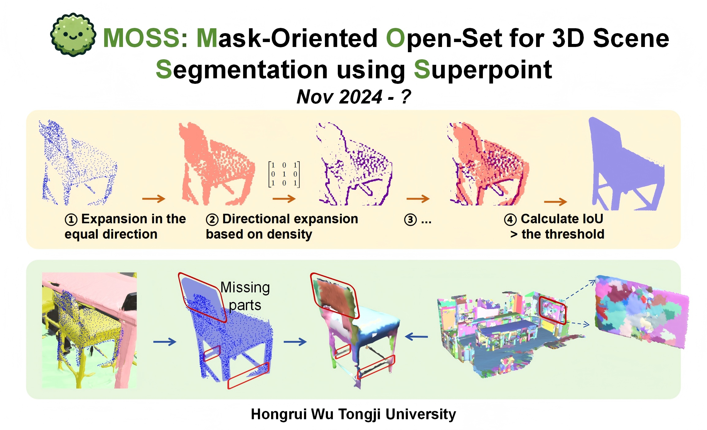

Hi there!👋

I am currently a CS junior student in [Tongji University](https://en.tongji.edu.cn/p/). During my first three years of university, I majored in [Intelligent Construction](https://civileng.tongji.edu.cn/civilengen/18034/list.htm), in the [College of Civil Engineering](https://civileng.tongji.edu.cn/civilengen/main.htm).     
Driven by research interests, I transferred to Computer Science and will receive my Bachelor's degree in 2026 and actively seek 26fall PhD opportunities!🎓

Research Interests
======
My research interests currently lie in **open-set understanding for 3D scenes** and **AIGC for 3D vision**. In the future, I aim to explore the application of generative models in **3D reconstruction** and **3D scene re-editing**.   
Through developing scalable and efficient methods, I strive to bridge the gap between real-world data and AIGC, pushing the boundaries of 3D content generation and scene understanding for both academic and industrial applications.

Current Research
======

   

       
   

   

       <h2 style="margin-top: 0;">MOSS: Mask-Oriented Open-Set for 3D Scene Segmentation using Superpoint</h2>
       <!-- 
<strong>Hongrui Wu</strong>
 -->
       
<em>Preparing for ICCV 2025</em>

       

           <a href="#">[PPT]</a>
           <a href="#">[Video]</a>
       

   

   

       
   

   

       <h2 style="margin-top: 0;"><strong>Universe</strong>: Unleashing the Consistent Prior of Video Diffusion Models for Robust Reconstruction</h2>
       <!-- 
<strong>Hongrui Wu</strong>
 -->
       
<em>Preparing for ICCV 2025</em>

       

           <!-- <a href="#">[PPT]</a> -->
           

           A full presentation will be presented in an interview with you！
           

           <!-- <a href="#">[Video]</a> -->
       

   

Project \& Intern Experience
======
T

Cr
======
Fo

Ma
======
Th