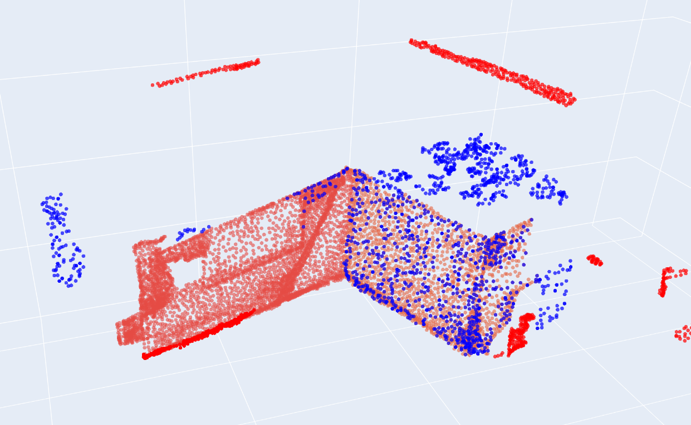

---
**Step4**   
======   
- [x] 可以大幅度提升的是分开的 也就是proposal的合并效果更明显优先级更高
- [ ] superpoint的自适应？
- [x] 角度变化小的2D mask可以舍弃，本质上是重复，没有意义
- [x] 带入每一个mask_m3的clip标签可以随机查看有没有label理解错误，速速整理代码OK？
- [x] mask_m3如果重合很高比如超过90%删除，保留大的mask或者中间的 704的water_cooler是一个很好的例子

---
**Quarrel with Daddy**   
======  
一言难尽实际上不是Quarrel啦，过几天搜点资料展开写一写然后写给以后成熟的我看一看